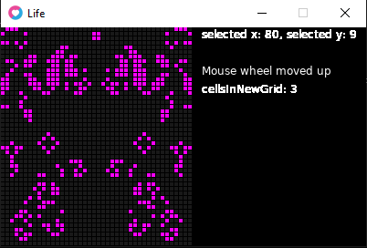

# life1

Cellular automata assisted pixel art tool & level editor made with LÖVE2D-framework.

Still only a tool for author's personal projects.

life1 uses rxi's excellent JSON library (included).

## Keyboard & mouse controls

### mouse wheel
Changes "S3" int the classic Conways B3/S23 rule.

### "space"
Runs one cycle with the current algorithm.

### "o"
Write JSON output to a .txt file.

### "i"
Load JSON output to a .txt file.

### "p"
Writes a .png image (in so called "1bit" style).

## TODO

### User defined size of the array
At the moment the size is fixed to author's current project.

### Optimization for larger arrays
Faster way to loop through the array.

### More algorithms and ways to manipulate them

### Proper file handling
User defined file-names etc. or in other words a proper save/load system.

### More versatile cell values and JSON I/O
To use life1 as a proper level editor the cells values should be non-binary.
